# Dictionary APP For IT

Xây dựng từ điển tiếng anh chuyên ngành công nghệ thông tin

## Thành viên:

1. Đoàn Quang Huy
2. Đỗ Quốc Sang

## desktop-app: winform c#, sql server

## rest-api: front end (winform C#), back end (laravel PHP), CSDL (mysql)

## Phiên bản ổn định: rest-api/DictionaryAppForIT

## Demo

### Đăng ký

### Đăng nhập

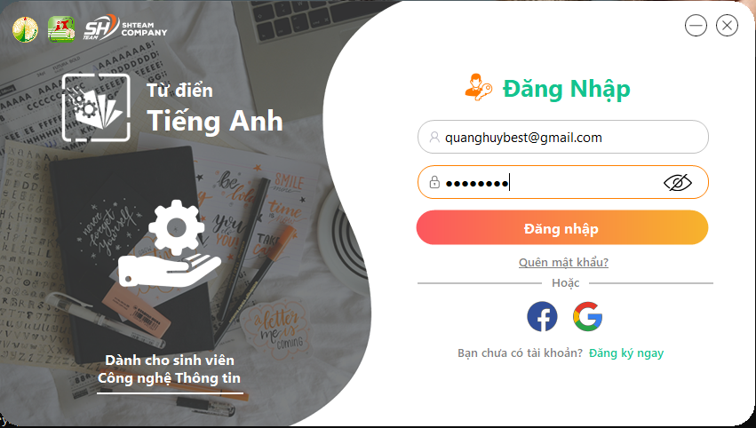

### Trang chủ

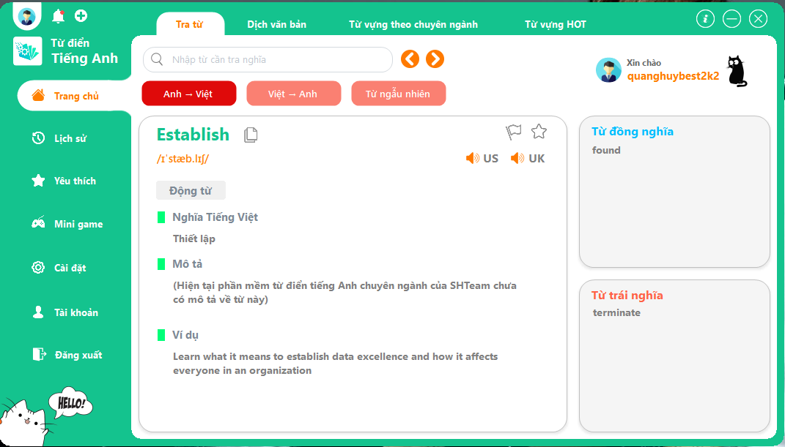

### Dịch

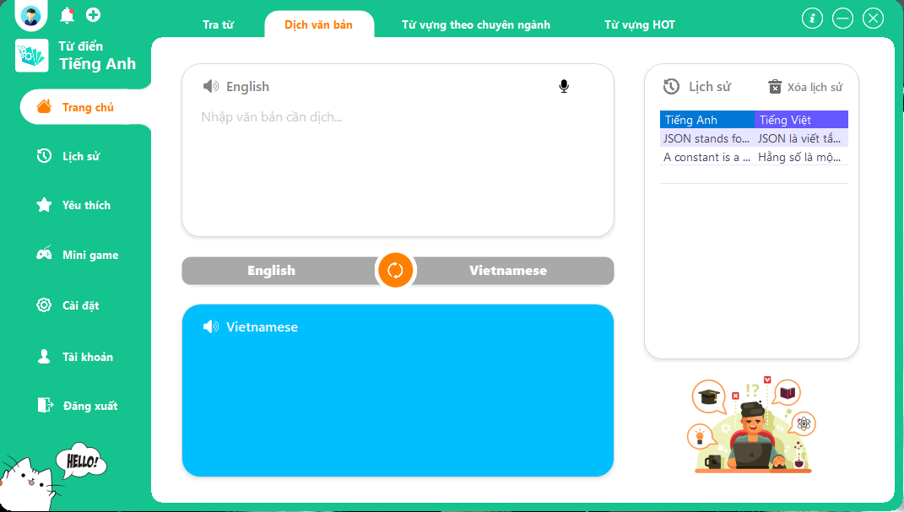

### Từ vựng theo chuyên ngành

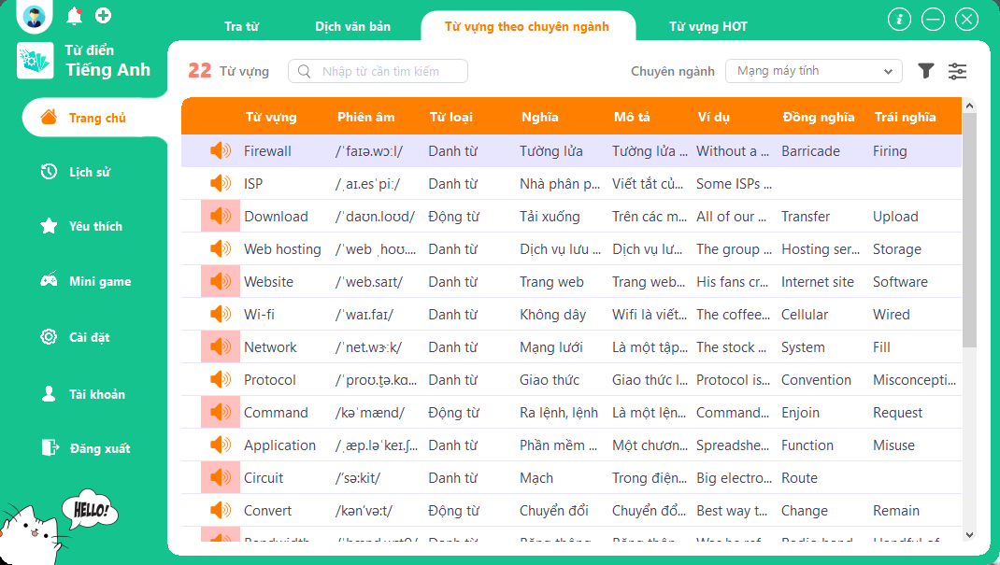

### Từ vựng hot

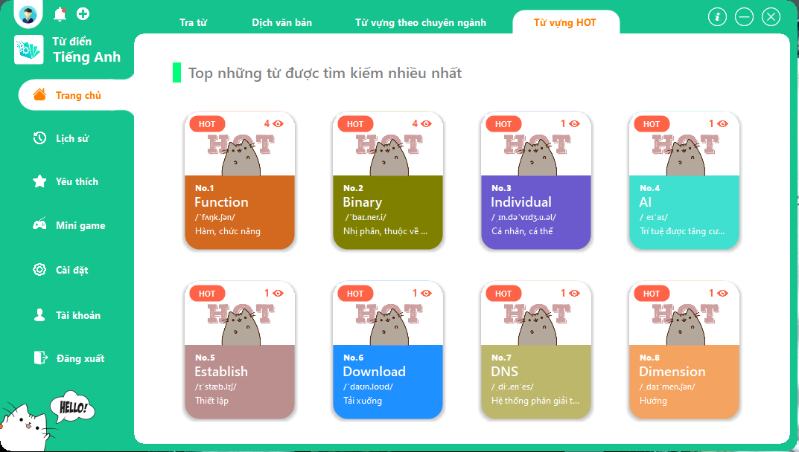

### Lịch sử

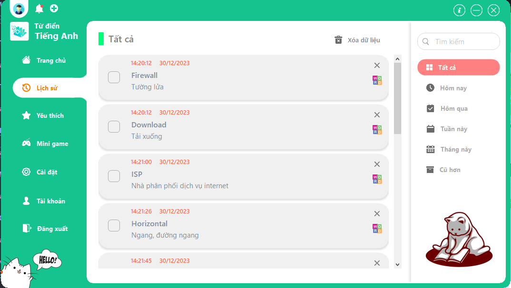

### Mục yêu thích

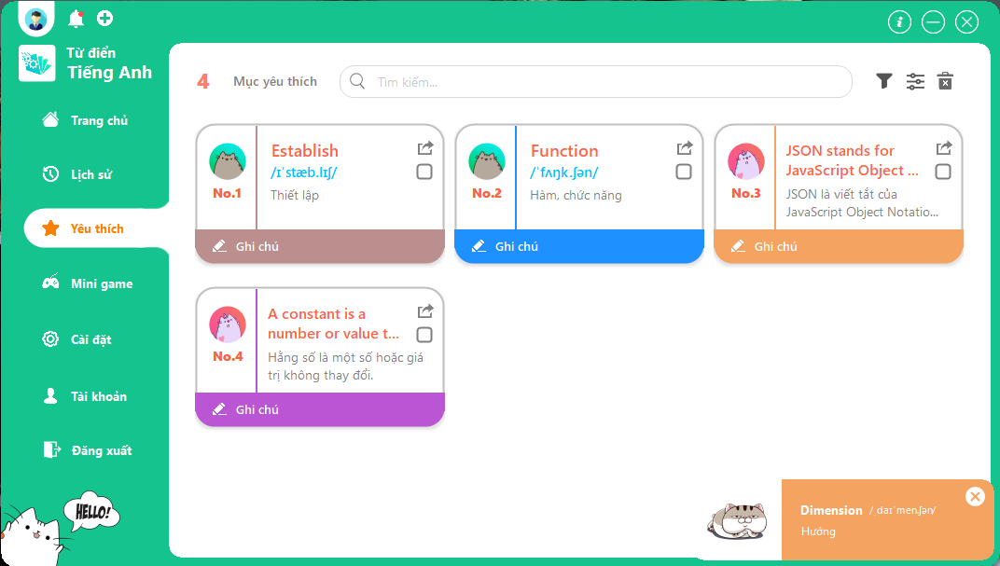

### Ghi chú mục yêu thích

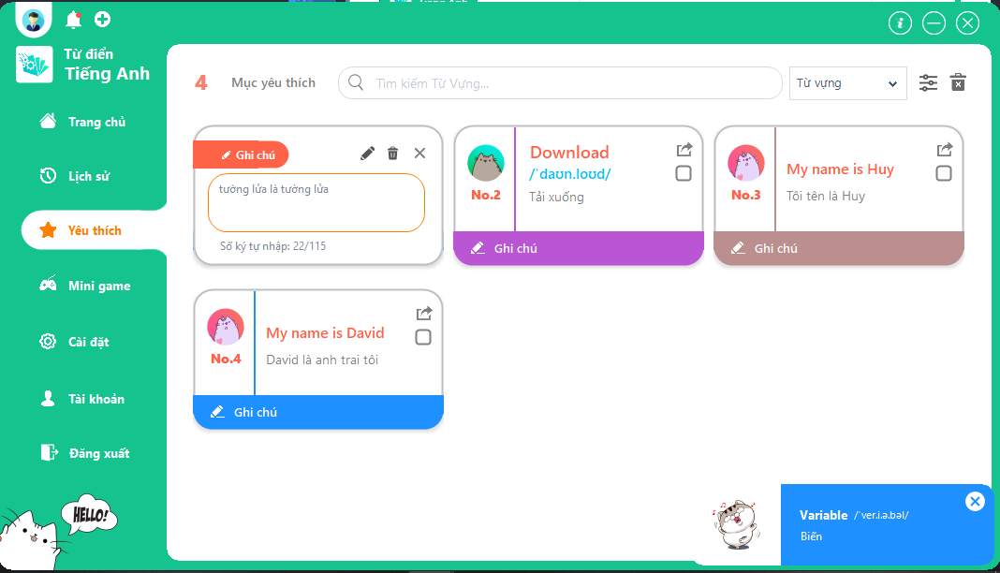

### Luật chơi Mini Game

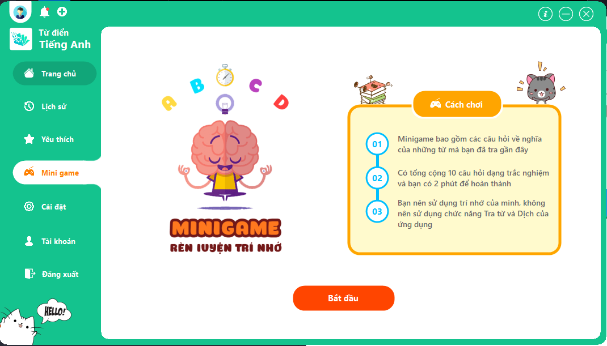

### Mini Game

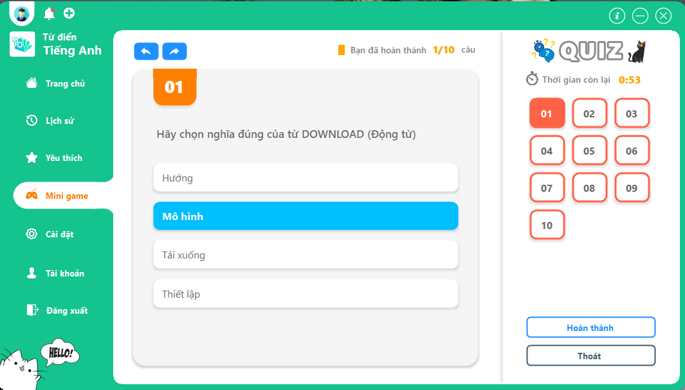

### Cài đặt

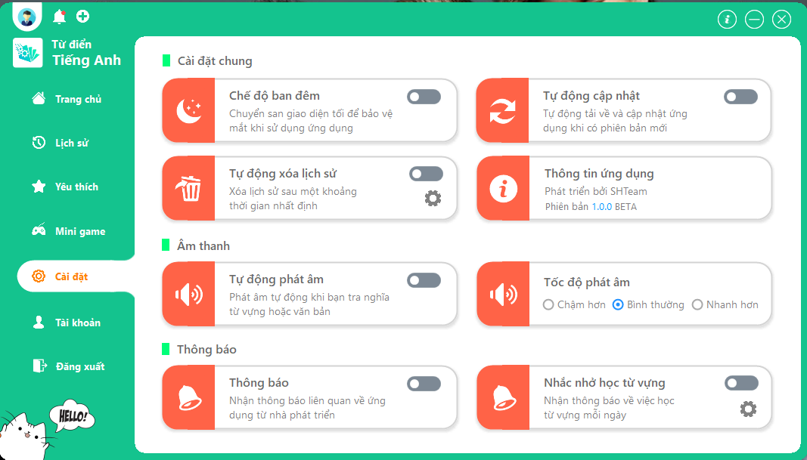

### Quản lý tài khoản

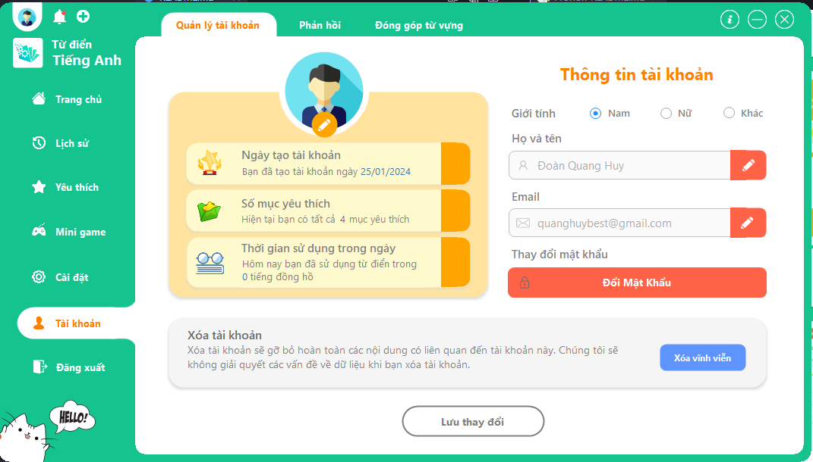

### Phản hồi đánh giá ứng dụng

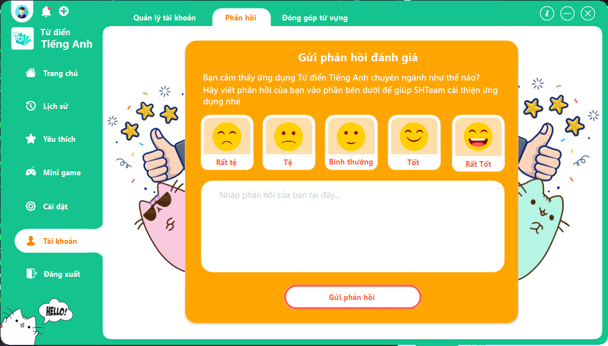

### Đóng góp từ vựng

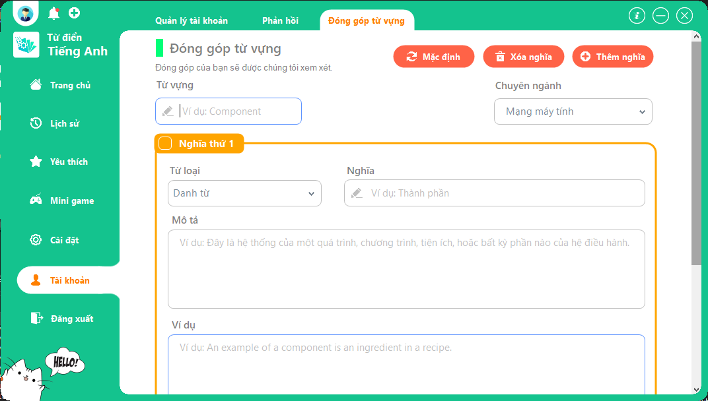

## Link server

[dictionary-server](https://github.com/quanghuybest2k2/dictionary-web/tree/main/dictionary-server)

 copyright &copy; 2022 - 2024 Đoàn Quang Huy 

